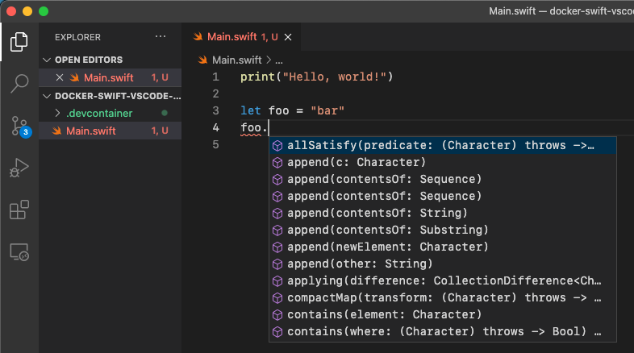

# Docker-Swift-VSCode-Ready

Thanks to [Visual Studio Code Remote - Containers extension](https://code.visualstudio.com/docs/remote/containers), now it's easy to write a code using VSCode inside a container. Regarding Swift, the [sourcekit-lsp](https://github.com/apple/sourcekit-lsp/tree/main/Editors#visual-studio-code) allows us to get more power on editor window however it requires manual steps to install the extension so I wrote a specific [Dockerfile](./.devcontainer/Dockerfile) to do everything automatically. Thus we can start writing Swift as soon as you open this repo using `Remote-Container`.

## Usage

1. Clone
2. Open the repository in VSCode Dev Container
3. Open the terminal (to run .bashrc to active sourcekit-lsp extension)
4. Enjoy coding!

## Features

- Auto complete (by sourcekit-lsp)
- Format (by swift-format and `"editor.formatOnSave"`)
- You can build by `build` task, and test by `test` task (by [.vscode/tasks.json](.vscode/tasks.json))
